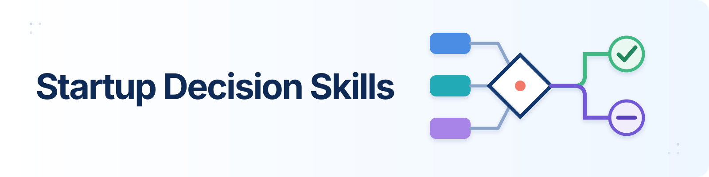

<p align="center">
  
</p>

<h1 align="center">Startup Decision Skills</h1>

<p align="center">
  <strong>Reusable Agent Skills for evidence-grounded startup evaluation and investor-behavior research.</strong>
</p>

<p align="center">
  <a href="https://agentskills.io"></a>
  <a href="https://huggingface.co/datasets/quge007/eventchain"></a>
  <a href="LICENSE"></a>
</p>

Sixteen composable skills turn startup proposals and public-source records
into structured candidate cards, time-bounded evidence checks, canonical
entities, event chains, and auditable retrospective patterns. The collection
covers both sides of a startup decision:

- **Before investment:** evaluate an idea without leaking its later outcome.
- **After investment:** reconstruct how funding, exposure, and investor-company
  interface events unfold over time.

## Start here

Choose the smallest skill that matches the task. Use
[`evaluate-proposal`](skills/evaluate-proposal/) only for the complete proposal
pipeline; use its component skills directly when you need one stage.

```bash
git clone https://github.com/quge009/startup-decision-skills.git
cp -r startup-decision-skills/skills/evaluate-proposal ~/.claude/skills/
cp -r startup-decision-skills/skills/candidate-classifier ~/.claude/skills/
cp -r startup-decision-skills/skills/tavily-query-builder ~/.claude/skills/
cp -r startup-decision-skills/skills/check-interpreter ~/.claude/skills/
```

Each folder follows the [Agent Skills](https://agentskills.io) convention: a
required `SKILL.md` plus only the scripts, references, schemas, and examples the
workflow needs. Install folders in the skill directory supported by your agent
runtime.

## Skill catalog

### Proposal evaluation

| Skill | What it does |
|---|---|
| [`evaluate-proposal`](skills/evaluate-proposal/) | Orchestrates proposal → candidate card → evidence checks → verdict and reasoning |
| [`candidate-classifier`](skills/candidate-classifier/) | Produces the five-dimension candidate card, archetype, and founding year |
| [`tavily-query-builder`](skills/tavily-query-builder/) | Builds uniform M-check and U-check research queries |
| [`check-interpreter`](skills/check-interpreter/) | Retrieves time-bounded evidence and interprets market and moat checks |
| [`outcome-labeling`](skills/outcome-labeling/) | Maps company records to the fixed eight-label outcome ontology |
| [`leakage-scan`](skills/leakage-scan/) | Detects post-founding outcome information in candidate cards |
| [`cohort-sampling`](skills/cohort-sampling/) | Builds benchmark cohorts and deterministic train/validation samples |
| [`f05-stats`](skills/f05-stats/) | Computes F0.5, Wilson intervals, and confusion-matrix statistics |

### Investor and event-chain research

| Skill | What it does |
|---|---|
| [`portfolio-edge-builder`](skills/portfolio-edge-builder/) | Authors selectors, extracts portfolio pages, audits edges, and merges source tables |
| [`entity-dedup`](skills/entity-dedup/) | Resolves company and investor names into stable canonical identities |
| [`event-evidence-collector`](skills/event-evidence-collector/) | Collects source-grounded funding, exposure, and interface event claims |
| [`event-claim-resolution`](skills/event-claim-resolution/) | Merges multi-source claims into auditable canonical events |
| [`event-chain-builder`](skills/event-chain-builder/) | Materializes funding, exposure, and interface events into outcome chains |
| [`interface-identity-resolution`](skills/interface-identity-resolution/) | Resolves reviewed Interface counterparties into investor or associated identities |
| [`pattern-engine`](skills/pattern-engine/) | Freezes, audits, evaluates, and registers label-blind event-chain patterns |
| [`post-investment-behavior`](skills/post-investment-behavior/) | Derives descriptive investor behavior from temporally ordered investment evidence |

## How the collection fits together

```text
Proposal → Candidate card → Time-bounded M/U evidence → Decision
                               │
Public sources → Portfolio edges → Entities → Event evidence → Event chains → Patterns
                                      └→ Interface identities → Post-investment behavior
```

`RECOMMEND` and `AVOID` in the pattern engine label **operating actions observed
within event chains**. They are not labels assigned to companies.

## Requirements

Several skills use only the Python standard library. Install optional packages
for the workflows you plan to run:

| Workflow | Packages |
|---|---|
| Evidence retrieval | Tavily CLI (`tvly`) and API access |
| Entity and chain processing | `pandas`, `pyarrow`, `pyyaml` |
| Portfolio extraction | `pyyaml`, `beautifulsoup4`, `lxml` |

```bash
pip install pandas pyarrow pyyaml beautifulsoup4 lxml
```

LLM-guided skills require a compatible agent runtime. Online evidence retrieval
requires `TAVILY_API_KEY`; credentials must be supplied through the environment
and must never be stored in this repository.

## Dataset

The companion [EventChain dataset](https://huggingface.co/datasets/quge007/eventchain)
contains the released entities, provenance, events, and chain tables. See
[`datasets-index.md`](datasets-index.md) for scope and licensing boundaries.

## Scope and validation

These skills package the methods used in the companion research. They are
research tools, not investment advice, and they do not guarantee complete
coverage of private company activity. Deterministic scripts validate schemas
and fail loudly on contract violations; LLM- and web-dependent outputs still
require source review.

All `SKILL.md` files pass the Agent Skills structural validator, and all bundled
Python files are syntax-checked before release.

## License

Code and skill instructions are released under the [MIT License](LICENSE).
Dataset files are separately released under CC BY 4.0.
